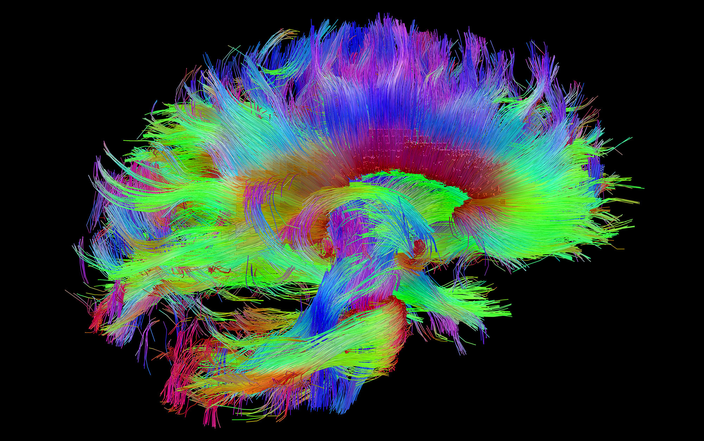

# Human Connectome
</img>

## Inspiration
Brain connectomics or brain network research has rapidly expanded using functional MRI (fMRI) and diffusion-weighted MRI (dwMRI). A common product of these varied analyses is a connectivity matrix (CM). A CM stores the connection strength between any two regions ("nodes") in a brain network. This format is useful for several reasons: 
1. it is highly distilled, with minimal data size and complexity
2. graph theory can be applied to characterize the network's topology
3. it retains sufficient information to capture individual differences such as age, gender, intelligence quotient (IQ), or disease state

In this project, the connectivity matrices of patients diagnosed with autism spectrum disorder (ASD) and typically developing (TD) autism are compared using graph statistical algorithms to determine regions of the brain associated with development of autism. 

## Dataset
[UCLA's Autism brain connectome dataset](http://umcd.humanconnectomeproject.org/umcd/default/get_study_data/UCLA_Autism)

## Statistical Analysis
This analysis relies on a simplified 2-complex based order d Forman–Ricci curvature of an edge $e = \{u, v\} \in E$ is given by:

$\mathfrak{C}_G^{2, d}(e) \stackrel{\text { def }}{=} \mathfrak{C}_G^{2, d}(u, v)=\omega(e)\left[\left(\sum_{e \sim f_d^2} \frac{\omega(e)}{\omega\left(f_d^2\right)}+\sum_{v \sim e} \frac{\omega(v)}{\omega(e)}\right)-\sum_{e^{\prime} \| e, e^{\prime}, e \sim f_d^2} \frac{\sqrt{\omega(e) \omega\left(e^{\prime}\right)}}{\omega\left(f_d^2\right)}\right]$

The difference of the curvatures is found between a pair of autism spectrum disorder (ASD) and typically developing (TD) autism connectivity matrices each constructed by taking the aggregated mean of all such similar samples corresponding to each diagnosis.

More information about the methodology can be found in the following paper:
https://www.nature.com/articles/s41598-021-87587-z

## Results
### All nonzero curvature differences
| Region                                         | Curvature Difference |
| ---------------------------------------------- | -------------------- |
| Right Juxtapositional Lobule Cortex            | -7074.627324268871   |
| Right Pallidum                                 | -4627.960045217761   |
| Right Inferior Frontal Gyrus pars triangularis | -4530.6795865866325  |
| Right Central Opercular Cortex                 | -3888.4297739512394  |
| Brain-Stem                                     | 2419.6440218672715   |
| Right Thalamus                                 | 4013.0091411239337   |
| Right Middle Frontal Gyrus                     | 4978.582665601203    |

### Statistically significant curvature differences
| Region                                         | Curvature Difference |
| ---------------------------------------------- | -------------------- |
| Right Juxtapositional Lobule Cortex            | -7074.627324268871   |
| Right Pallidum                                 | -4627.960045217761   |
| Right Inferior Frontal Gyrus pars triangularis | -4530.6795865866325  |
| Right Central Opercular Cortex                 | -3888.4297739512394  |
| Right Thalamus                                 | 4013.0091411239337   |
| Right Middle Frontal Gyrus                     | 4978.582665601203    |

## Discussion
The six regions of the brain yielding statistically significant results (from most significant to least significant) towards the development of autism are:
1. Right Juxtapositional Lobule Cortex   
2. Right Middle Frontal Gyrus          
3. Right Pallidum                                 
4. Right Inferior Frontal Gyrus pars triangularis             
5. Right Thalamus   
6. Right Central Opercular Cortex    

## References
Chatterjee, T., Albert, R., Thapliyal, S. *et al.* Detecting network anomalies using Forman–Ricci curvature and a case study for human brain networks. *Sci Rep* **11**, 8121 (2021). https://doi.org/10.1038/s41598-021-87587-z