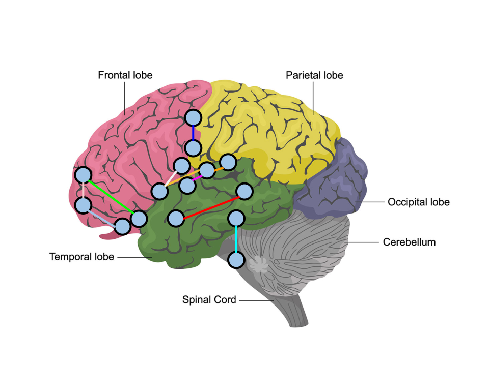

# Human Connectome
</img>

- [Human Connectome](#human-connectome)
  - [Inspiration](#inspiration)
  - [Statistical Analysis](#statistical-analysis)
  - [Results](#results)
    - [Top 10 Statistically Significant Curvature Differences](#top-10-statistically-significant-curvature-differences)
      - [5 Most Negative Curvatures](#5-most-negative-curvatures)
      - [5 Most Positive Curvatures](#5-most-positive-curvatures)
  - [Discussion](#discussion)
    - [Connections Visualized](#connections-visualized)
  - [Replicate Results](#replicate-results)
    - [Clone the Repo](#clone-the-repo)
    - [Download the dataset](#download-the-dataset)
    - [Extract the dataset](#extract-the-dataset)
    - [Run analysis](#run-analysis)
  - [Unit Tests](#unit-tests)
  - [Collaborators](#collaborators)
  - [References](#references)


## Inspiration
Brain connectomics or brain network research has rapidly expanded using functional MRI (fMRI) and diffusion-weighted MRI (dwMRI). A common product of these varied analyses is a connectivity matrix (CM). A CM stores the connection strength between any two regions ("nodes") in a brain network. This format is useful for several reasons: 
1. it is highly distilled, with minimal data size and complexity
2. graph theory can be applied to characterize the network's topology
3. it retains sufficient information to capture individual differences such as age, gender, intelligence quotient (IQ), or disease state

In this project, the connectivity matrices of patients diagnosed with autism spectrum disorder (ASD) and typically developing (TD) autism are compared using graph statistical algorithms to determine regions of the brain associated with development of autism. 

## Statistical Analysis
This analysis relies on a simplified 2-complex based order d Forman–Ricci curvature [[1]](#1) of an edge $e = \{u, v\} \in E$ is given by:

$$\begin{aligned}
\mathfrak{C}_G^{\,2,d}(e) \stackrel{\mathrm{def}}{=} \mathfrak{C}_G^{\,2,d}(u,v) = \omega(e) \left[ \left( \sum_{e \sim f_d^2} \frac{\omega(e)}{\omega(f_d^2)} + \sum_{v \sim e} \frac{\omega(v)}{\omega(e)} \right) - \sum_{e'||e, e',e \sim f_d^2} \frac{\sqrt{\omega(e) \omega(e')}}{\omega(f_d^2)} \right] 
\end{aligned}$$

The difference of the curvatures is found between a pair of autism spectrum disorder (ASD) and typically developing (TD) autism connectivity matrices each constructed by taking the aggregated mean of all such similar samples corresponding to each diagnosis.

## Results

### Top 10 Statistically Significant Curvature Differences
It is important to note that some connections may occur in the same region of the brain, hence it may seem like a vertex is connected to itself which is not the case.

#### 5 Most Negative Curvatures 

| Connected Region                                 | Curvature Difference |
| ------------------------------------------------ | -------------------- |
| Right Putamen, Right Insular Cortex              | -2331330.433152141   |
| Right Insular Cortex, Right Insular Cortex       | -1994182.8538039196  |
| Right Frontal Pole, Right Frontal Orbital Cortex | -1845748.8731592936  |
| Right Frontal Pole, Right Frontal Pole           | -1716334.5267126393  |
| Right Insular Cortex, Right Insular Cortex       | -1614932.5721171317  |

#### 5 Most Positive Curvatures 
| Connected Region                                                                             | Curvature Difference |
| -------------------------------------------------------------------------------------------- | -------------------- |
| Left Central Opercular Cortex, Left Central Opercular Cortex                                 | 1934234.5367499162   |
| Right Insular Cortex, Right Putamen                                                          | 1971224.916725241    |
| Left Thalamus, Brain-Stem                                                                    | 2294358.294582237    |
| Right Frontal Pole, Right Frontal Orbital Cortex                                             | 2565673.39796964     |
| Left Middle Temporal Gyrus posterior division, Left Middle Temporal Gyrus posterior division | 3425965.9113210947   |

## Discussion
The ten connections between the brain yielding statistically significant results (from most significant to least significant) towards the development of autism are:

1. Left Middle Temporal Gyrus posterior division, Left Middle Temporal Gyrus posterior division 
2. Right Frontal Pole, Right Frontal Orbital Cortex
3. Right Putamen, Right Insular Cortex   
4. Left Thalamus, Brain-Stem     
5. Right Insular Cortex, Right Insular Cortex   
5. Right Insular Cortex, Right Putamen   
6. Left Central Opercular Cortex, Left Central Opercular Cortex 
8. Right Frontal Pole, Right Frontal Orbital Cortex
7. Right Frontal Pole, Right Frontal Pole
9. Right Insular Cortex, Right Insular Cortex   

### Connections Visualized
</img>

## Replicate Results
### Clone the Repo 
```bash
git clone https://github.com/lavaman131/human_connectome.git
```
### Download the dataset
[UCLA's Autism brain connectome dataset](http://umcd.humanconnectomeproject.org/umcd/default/get_study_data/UCLA_Autism)
### Extract the dataset
Unzip the downloaded file
### Run analysis
1. Locate the `lib.rs` script in the relative path `human_connectome/src/lib.rs` and change the absolute paths to the appropriate locations:
```rust
// initialize paths HERE
// the absolute path of your data folder
pub const DATA_DIR: &str = "ABSOLUTE PATH OF UCLA_AUTISM DATASET GOES HERE";
/* the absolute path of the directory 
where you want to store results of analysis*/
pub const SAVE_DIR: &str = "ABSOLUTE PATH OF WHERE YOU WANT TO STORE RESULTS GOES HERE";
```
2. Run the `save_files.rs` script by entering the following command:
```bash
cargo run --bin save_files --release
```
3. Run the `main.rs` script to analyze the saved data: 
```bash
cargo run --bin main --release
```
This will output the top 5 most positive and top 5 most negative edges based on curvature difference:
```bash
Top 10 Statistically significant curvature differences:
5 Most Negative Curvatures:
Regions: ("Right Putamen", "Right Insular Cortex")      Curvature Difference: -2331330.433152141
Regions: ("Right Insular Cortex", "Right Insular Cortex")       Curvature Difference: -1994182.8538039196
Regions: ("Right Frontal Pole", "Right Frontal Orbital Cortex") Curvature Difference: -1845748.8731592936
Regions: ("Right Frontal Pole", "Right Frontal Pole")   Curvature Difference: -1716334.5267126393
Regions: ("Right Insular Cortex", "Right Insular Cortex")       Curvature Difference: -1614932.5721171317
5 Most Positive Curvatures:
Regions: ("Left Central Opercular Cortex", "Left Central Opercular Cortex")     Curvature Difference: 1934234.5367499162
Regions: ("Right Insular Cortex", "Right Putamen")      Curvature Difference: 1971224.916725241
Regions: ("Left Thalamus", "Brain-Stem")        Curvature Difference: 2294358.294582237
Regions: ("Right Frontal Pole", "Right Frontal Orbital Cortex") Curvature Difference: 2565673.39796964
Regions: ("Left Middle Temporal Gyrus posterior division", "Left Middle Temporal Gyrus posterior division")     Curvature Difference: 3425965.9113210947
```

## Unit Tests
```rust
cargo test
```

## Collaborators
* Dr. Tanima Chatterjee

## References
<a id="1">[1]</a> Chatterjee, T., Albert, R., Thapliyal, S. *et al.* Detecting network anomalies using Forman–Ricci curvature and a case study for human brain networks. *Sci Rep* **11**, 8121 (2021). https://doi.org/10.1038/s41598-021-87587-z
